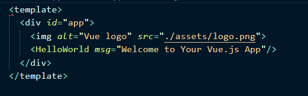
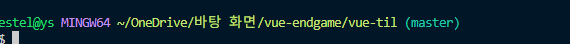
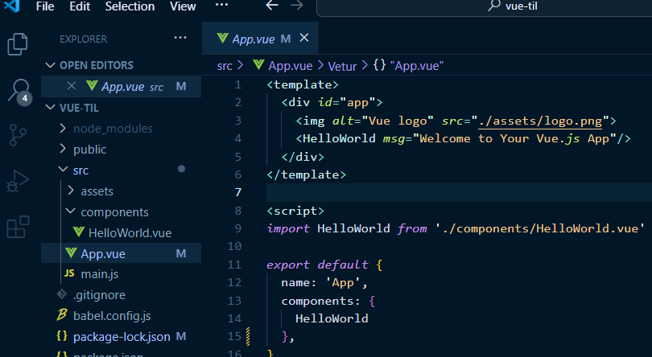

# Vue 2 프로젝트에서 `<template>` 태그 빨간 줄 오류 원인 및 해결 기록




## 문제 상황

- Vue 2 기반 프로젝트(`vue-til`)에서 `<template>` 태그에 빨간 물결(~) 오류 발생
- 실제 코드에는 문법적 오류 없음
- 실행 (`npm run serve`)은 정상적으로 작동

```vue
<template>
  <div id="app">
    
    <HelloWorld msg="Welcome to Your Vue.js App"/>
  </div>
</template>
```


## 원인
상위 폴더를 열어 작업했기 때문이였다. 
VSCode에서 vue-endgame 전체를 열고 vue-til/src/App.vue를 편집한 경우, Vetur가 .vue 파일을 제대로 파싱하지 못해 <template>에 빨간 줄 표시됨


## 해결 
VSCode에서 루트 전체(vue-endgame)가 아닌
vue-til 프로젝트 디렉토리만 단독으로 열기

🔗 참고 링크: 코딩애플 포럼 - VSCode 빨간줄 이슈
: https://codingapple.com/forums/topic/vs%EC%BD%94%EB%93%9C-%EC%97%90%EB%94%94%ED%84%B0-%EB%B7%B0-%EB%B9%A8%EA%B0%84%EC%A4%84-%EC%9D%B4%EC%8A%88/

